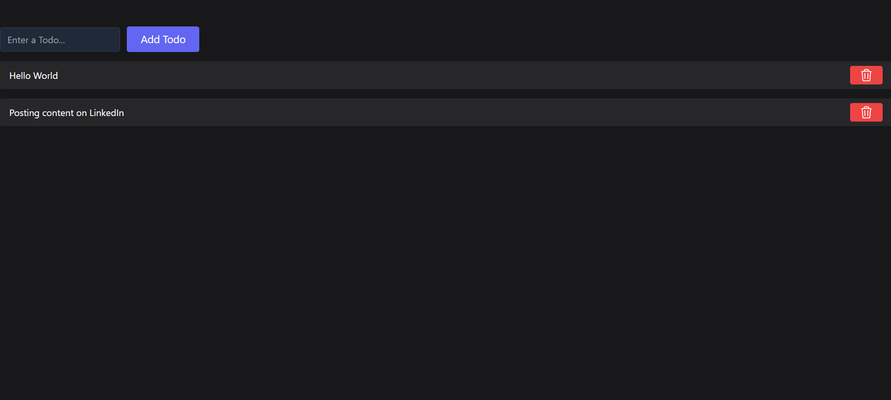

## Todo App

This Todo App is a simple yet powerful tool for managing your tasks. It allows you to add, delete, mark as done, and edit todos conveniently. Built with Redux Toolkit (RTK) and utilizing local storage for data persistence, this app provides a seamless user experience.

### Features

1. **Add Todo**: Easily add new tasks to your list.
2. **Delete Todo**: Remove unwanted todos with a simple click.
3. **Mark Todo as Done**: Keep track of completed tasks by marking them as done.
4. **Edit Todos**: Update the content of existing todos effortlessly.

### Preview

[]

### Technologies Used

- **React**: The front-end is built using React library, providing a fast and responsive user interface.
- **Redux Toolkit (RTK)**: Utilized for state management, making it easy to manage complex application state.
- **Local Storage**: Used for storing todos locally in the web browser, ensuring data persistence even after page refresh.

### Learnings

- **Redux Toolkit**: Gained proficiency in using Redux Toolkit for efficient state management.
- **Local Storage**: Learned how to utilize local storage in web applications for data persistence.
- **Component Lifecycle**: Improved understanding of React component lifecycle methods for managing state and data flow.

### Usage

1. Clone the repository.
2. Install dependencies using `npm install`.
3. Run the app using `npm run dev`.
4. Start managing your todos efficiently!

### Author

Vishal Pandey

